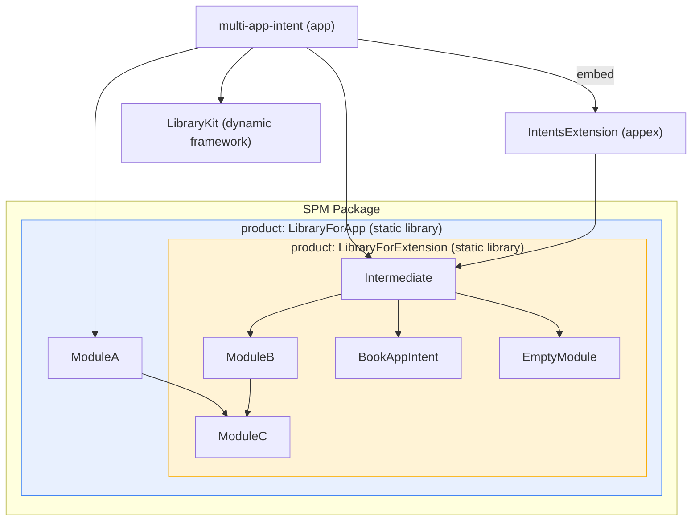

# appintentsmetadata

App Intents メタデータ(`appintentsmetadataprocessor` の出力)がモジュール構成によってどう変わるかを試すプロジェクトです。

## モジュール構成

- `multi-app-intent`(app): アプリ本体。
- `IntentsExtension`(appex): App Intents extension。
- `LibraryKit`(dynamic framework): 動的フレームワーク。
- SPM `Package` の各モジュール:
  - `ModuleA` : ModuleCに依存
  - `ModuleB` : ModuleCに依存
  - `ModuleC` : ModuleA / ModuleB が共有する AppEntity を提供する葉モジュール
  - `Intermediate` : App Intents に無関係な空の中間モジュール。子のメタデータがアプリバンドルまで伝播することの確認用
  - `BookAppIntent` : AppSchema(`.books`)の挙動を見るモジュール
  - `EmptyModule` : App Intents に無関係な空の葉モジュール。メタデータ生成がスキップされることの確認用

## 依存ツリー



# swiftconstvalues

Swift コンパイラの **const value extraction**(`.swiftconstvalues` 出力)を最小構成で試すデモです。

## 構成

- `basic/` : 自作 protocol を対象にした最小デモ(抽出パターンの網羅)
- `appintents/` : 実際の AppIntents フレームワークを対象にしたデモ
- `typesystem/` : ConstExtract が型システムに乗っていることを示すデモ

各デモは `Source.swift` / `protocols.json` の 2 点セットです。ビルドは `Makefile` が共通で担います:

```bash
cd swiftconstvalues
make        # 全デモ
make basic  # 個別実行も可
```

実行されるコマンドはどのデモも同じ形です:

```bash
xcrun swiftc -typecheck Source.swift \
  -Xfrontend -emit-const-values-path -Xfrontend Source.swiftconstvalues \
  -Xfrontend -const-gather-protocols-file -Xfrontend protocols.json
```
